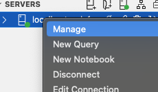

= 11월 마지막 주 데이터베이스 과제 초기 설정

`제 경우에 되었다는 것이니 어디까지나 참고용으로 삼아주시길 바랍니다`

`m2 맥북 업데이트를 하고 진행하면 되기도 합니다.
macOS Sonoma 14.1.1(23B81)`

* 도커 설치
* Azure Data Studio 설치
* 터미널에서 MS-SQL 2022버전 이미지 설치

 docker pull mcr.microsoft.com/mssql/server:2022-latest

* 도커에서 설치한 이미지 컨테이너에 실행
<DB 접근 패스워드>, <DB 이름!> 부분은 개인별로 변경하여 +
꺽쇠는 지워야함! 주의!

 docker run --cap-add SYS_PTRACE -e 'ACCEPT_EULA=1' -e 'MSSQL_SA_PASSWORD=<DB 접근 패스워드!>' -p 1433:1433 --name <DB 이름!> -d mcr.microsoft.com/mssql/server

* Docker - 컨테이너로 가서 Status가 실행되는지(Running)인지 확인

* Running이라면 Azure Data Studio 실행

* New connection

* 내용 기입
** Server : localhost
** Authentication type : SQL Login
** User name : sa (기본)
** Password : 앞에서 DB 접근 패스워드 기입
** 나머지 그냥 Connect

* 초록불이면 성공

== AdventureWorksLT2022 백업 파일 가져오기

Azure Data Studio가 읽어들인 것은 Docker를 읽을 것으로, MS-SQL의 디렉토리도 Docker 내부를 가리키고 있습니다. 때문에 Docker로 파일을 복사하여 옮겨줘야합니다

* AdventureWorksLT2022.bak 다운로드

link:https://learn.microsoft.com/ko-kr/sql/samples/adventureworks-install-configure?view=sql-server-ver16&tabs=ssms[다운로드 링크]

* AdventureWorksLT2022.bak 를 다운로드 한 곳으로 이동

 cd ...

* Docker에 파일 복사

<컨테이너 이름>은 4번에서 실행할 때 만든 <DB 이름!>을 넣어야함 +
편의상 /usr/local/에 저장함

 docker cp AdventureWorksLT2022.bak <컨테이너 이름>:/usr/local/

* Azure Data Studio로 이동

* 우클릭. Manage 클릭

* Restore 클릭

* 파일 찾기

* 최종 화면 Restore 하면 된다

힘내서 작업합시다!

---
참고
link:https://koreanddinghwan.github.io/database/0/[]
